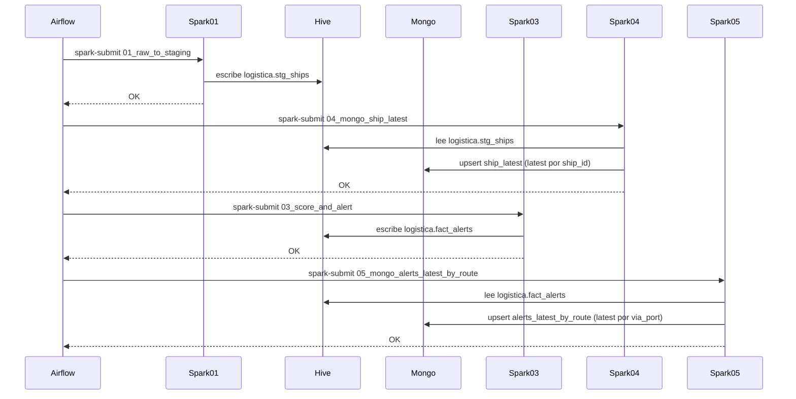
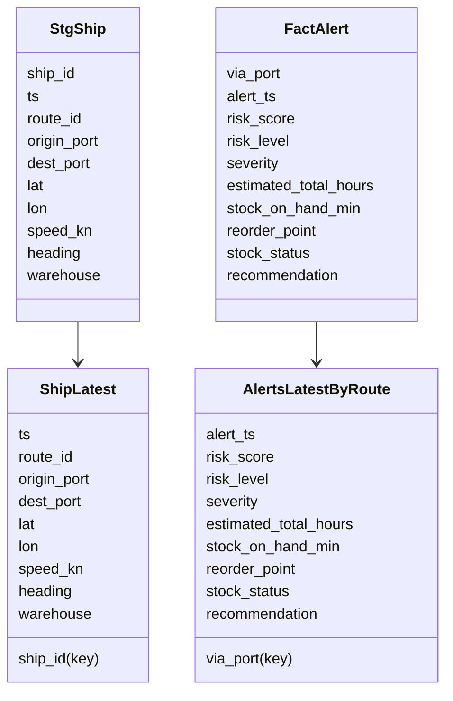

# UML - MongoDB (Variante B) en Mermaid

## 1) Diagrama de flujo (alto nivel)
```mermaid
flowchart LR
  A[Kafka\n(datos_crudos, alertas_globales)] --> B[HDFS Raw\nlanding JSONL]
  B --> C[Spark 01\nraw_to_staging]
  C --> D[Hive\nlogistica.stg_ships]
  D --> E[Spark 04\nmongo_ship_latest\n(upsert ship_latest)]

  B --> F[Spark 03\nscore_and_alert]
  F --> G[Hive\nlogistica.fact_alerts]
  G --> H[Spark 05\nmongo_alerts_latest_by_route\n(upsert alerts_latest_by_route)]
```

## 2) Secuencia (micro-lote)


## 3) Diagrama de clases (modelo de datos Mongo)


## 4) Diagrama de casos de uso (Variante B)
```mermaid
usecaseDiagram
  actor Usuario as U
  actor Airflow as A
  actor Spark as S
  actor Mongo as M

  A --> "Ejecutar micro-lote\n01_raw_to_staging" as UC1
  S --> "Calcular latest\nship_id" as UC1a
  M --> "Upsert ship_latest" as UC1b

  A --> "Ejecutar micro-lote\n03_score_and_alert" as UC2
  S --> "Calcular latest\nvia_port" as UC2a
  M --> "Upsert alerts_latest_by_route" as UC2b

  U --> "Consultar ship_latest\npor ship_id" as UC3
  U --> "Consultar alerts_latest\npor via_port" as UC4
```

